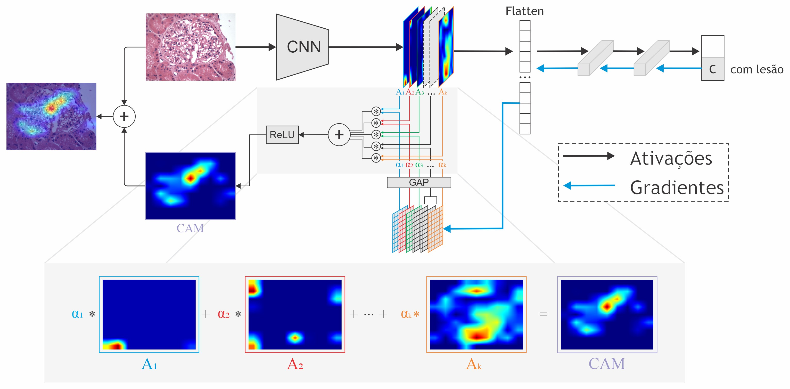
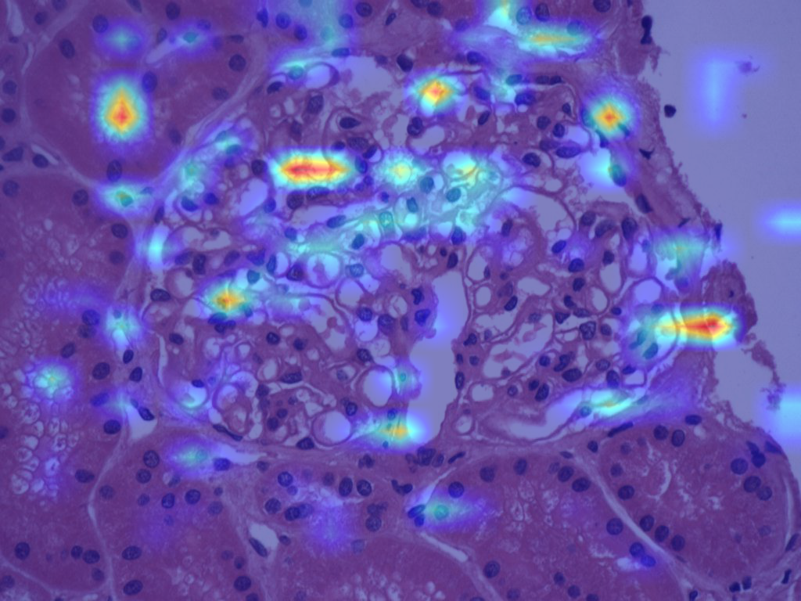
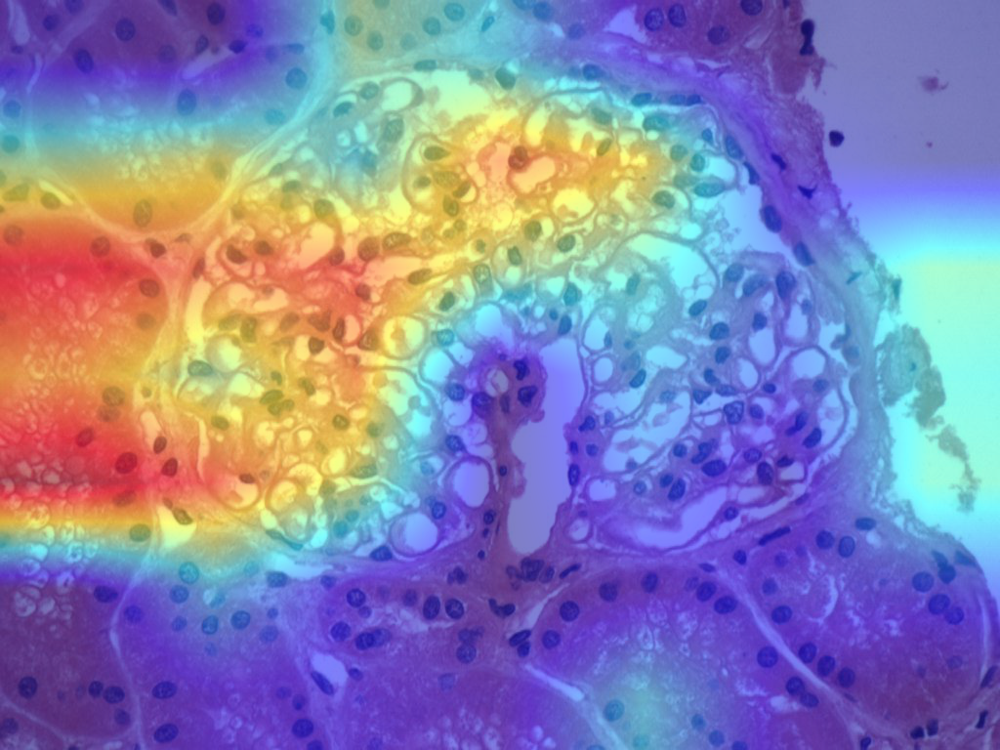
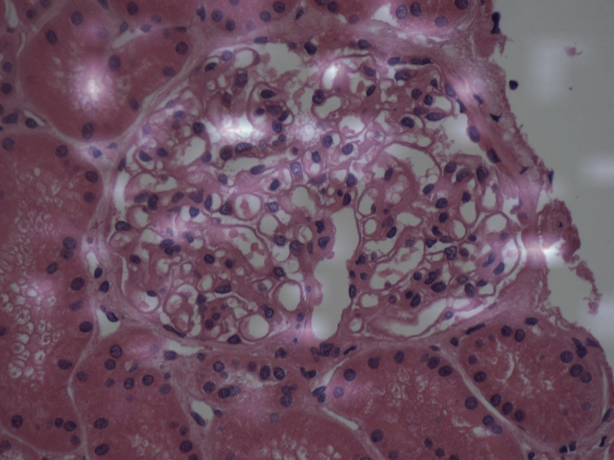
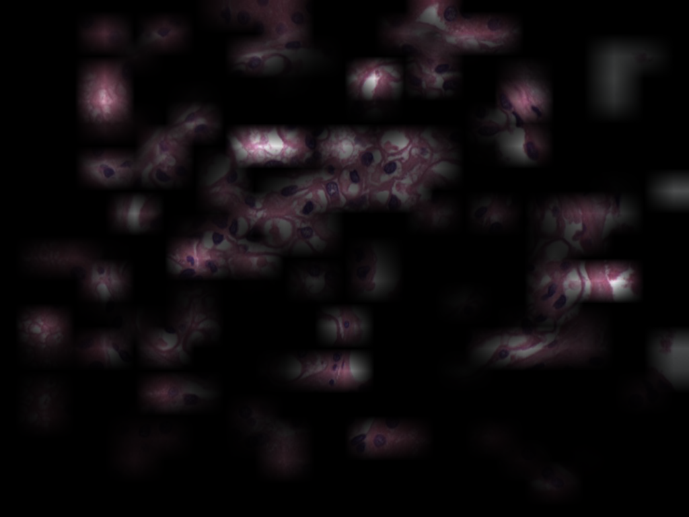
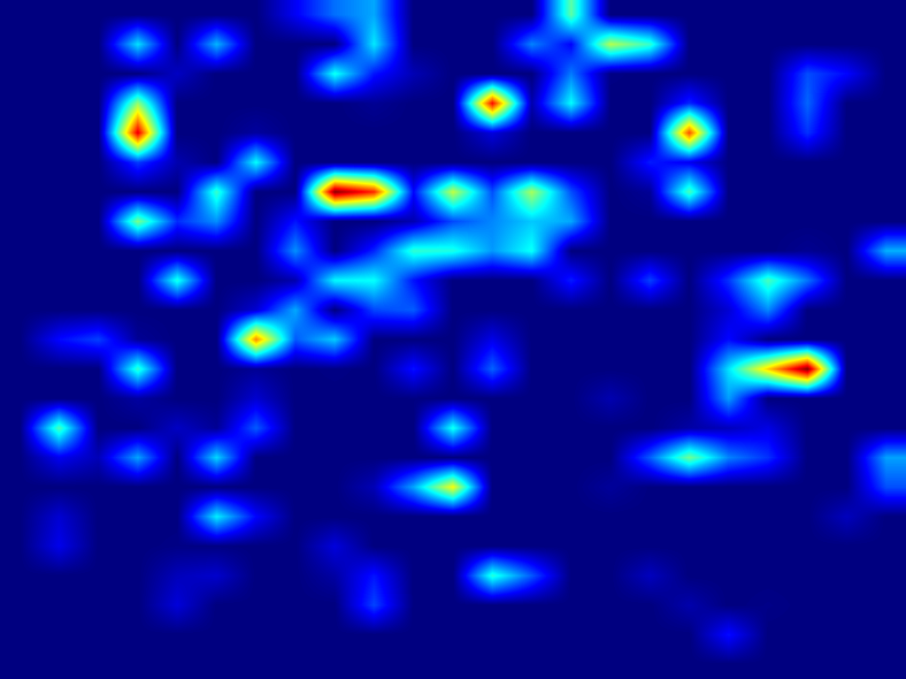
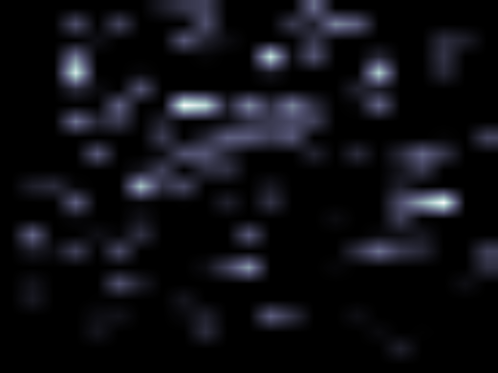

# PathoSpotter - Layer visualizer

## Architecture



## Single Image Analysis

### Setup

```
pip install -r requirements.txt
```

### Running

```
usage: single.py [-h] [--image_file IMAGE_FILE] [--model_file MODEL_FILE]
                 [--layer_name LAYER_NAME] [--label LABEL] [--method METHOD]
                 [--output_path OUTPUT_PATH] [--guided] [--no_plot]
```

### Options

Also available running `python single.py --help`
| Option | Description | Default value |
| ------------- | ------------- | ------------- |
| image_file | Path to the input image | ./examples/without.png |
| model_file | Path to the model file for the CNN model | ./models/glomeruloesclerose |
| layer_name | Layer to use for grad-CAM. Check [Architecture Summary section](#-architecture-summary) | all |
| label | Class label to generate grad-CAM for, -1 = use predicted class | -1 |
| method | Method used to visualize the grad-CAM | CAM_IMAGE_JET |
| output_path | Path to save images in | ./output |
| guided | Flag to activate guided method | false (deactivated) |
| no_plot | Flag to Deactivate plot output. Will generate one file for each layer to visualize | false (activated) |

## Architecture Summary

To check your model Architecture summary you may run `model_analysis.py`

```
usage: model_analysis.py [-h] [--model_file MODEL_FILE]
```

eg.:

```
$ python3 model_analysis.py --model_file=./models/glomeruloesclerose
```

This will generate a summary file under the model's path on which you will be able to check the layer's names of you model to specify a layer on `--layer_name` option

## Visualization methods

Useful list of possible methods to be used on `--method` option

| METHOD         | PREVIEW - max_pooling2d_33                                                                            | PREVIEW - conv2d_41                                                                           |
| -------------- | ----------------------------------------------------------------------------------------------------- | --------------------------------------------------------------------------------------------- |
| CAM_IMAGE_JET  |   |  |
| CAM_IMAGE_BONE |  |  |
| CAM_AS_WEIGHTS |  |  |
| JUST_CAM_JET   |    |  |
| JUST_CAM_BONE  |   |  |

## Roadmap

- [ ] Improve main.py file to deal with folders as input and process multiple input images at once
- [ ] Upload report
- [ ] Add experiments images on Readme to improve explanation
- [x] Add grad-cam architecture image on Readme
- [x] Add code references

## Reference Projects

- [Pytorch-grad-cam](https://github.com/jacobgil/pytorch-grad-cam/blob/master/gradcam.py)
- [Keras-grad-cam](https://github.com/jacobgil/keras-grad-cam)
- [Grad-cam](https://github.com/ramprs/grad-cam)
